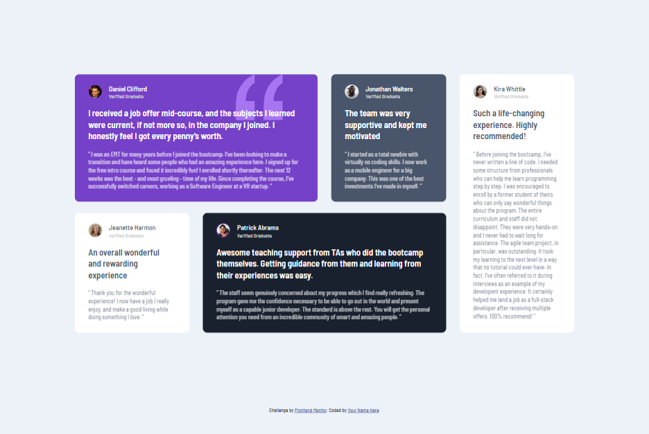

# Frontend Mentor - Testimonials grid section solution

# About

This is a solution to the [Testimonials grid section challenge on Frontend Mentor](https://www.frontendmentor.io/challenges/testimonials-grid-section-Nnw6J7Un7). Frontend Mentor challenges help you improve your coding skills by building realistic projects. 

## Table of contents

- [Overview](#overview)
  - [The challenge](#the-challenge)
  - [Links](#links)
- [Built with](#built-with)
- [Author](#author)

## Overview

### The challenge

Users should be able to:

- View the optimal layout for the site depending on their device's screen size

### Links

- Solution URL: [Solution](https://www.frontendmentor.io/solutions/testimonials-grid-section-css-grid-eXyySvUnUX)
- Live Site URL: [Live site](https://testimonials-grid-solution.netlify.app/)

## Built with

- Semantic HTML5 markup
- CSS custom properties
- Flexbox
- CSS Grid

## Author

- Frontend Mentor - [@UrielBucio](https://www.frontendmentor.io/profile/UrielBucio)
